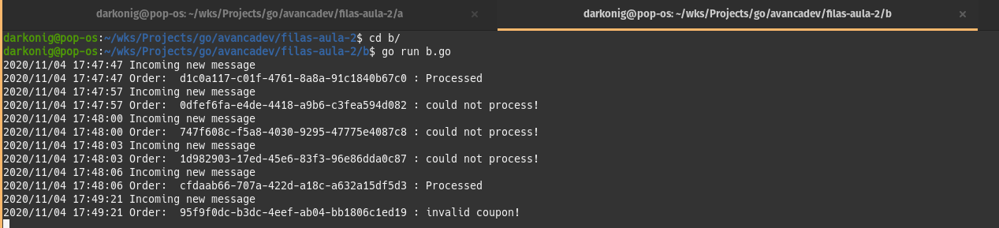

# Go lang Microservices

This repository has 4 services:
- A: checkout frontend, and publish the coupon and ccNumber to rabbitmq exchange `orders_ex`
- B: service process the coupon and ccNumber - reads the queue `orders` and send it the coupon code to service `C`, but if some an connection error happens rejects the queue message (publishing in the exchange `dlx`)
- C: checks if coupon is valid (valid coupon == abc)

